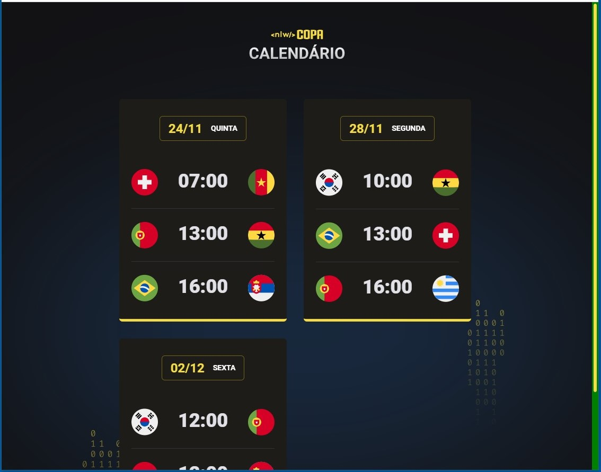

# NLW Copa 2022 - Trilha Explorer

Projeto desenvolvido no evento Next Level Week da Rocketseat.

🔗 [Clique aqui para visualizar e interagir com o meu projeto.](https://guilhermeemanuell.github.io/nlw-copa-explorer/){:target="_blank" rel="noopener"}

## 🛠 Tecnologias

- HTML
- CSS
- JavaScript
- Git e Github

## ✉ Contato

emanuellguilherme@gmail.com
